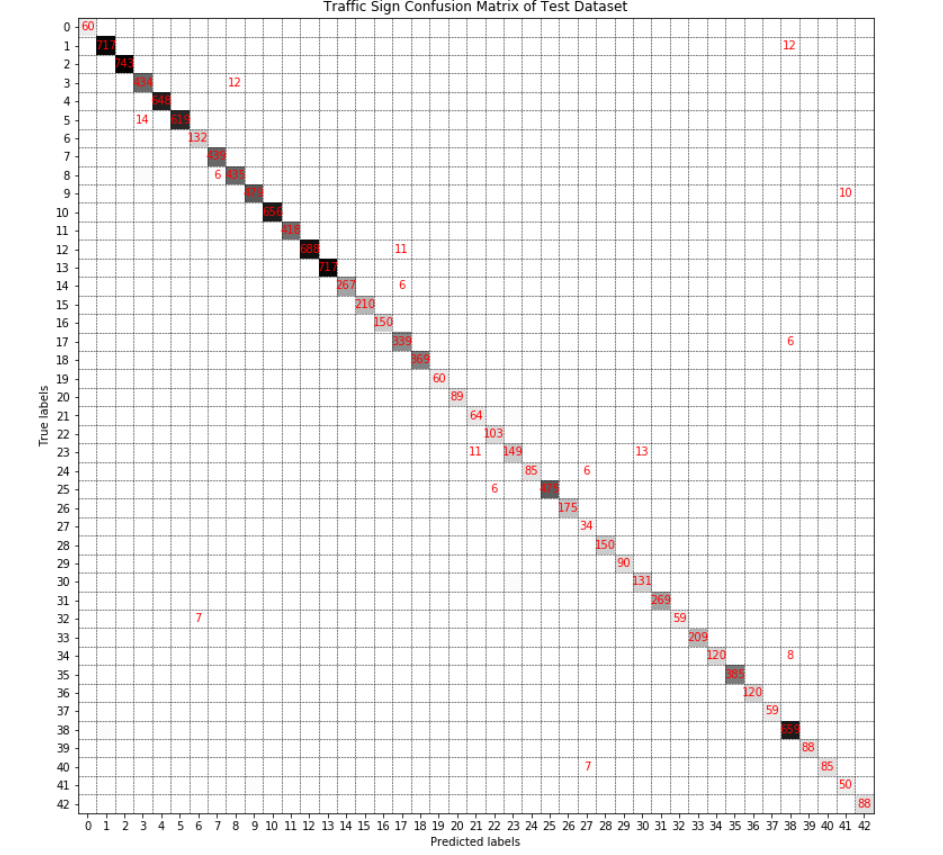

# Traffic Sign Recognition

## Goals

The goals / steps of this project are the following:
* [Load the data set](https://s3-us-west-1.amazonaws.com/udacity-selfdrivingcar/traffic-signs-data.zip)
* Explore, summarize and visualize the data set
* Design, train and test a model architecture
* Use the model to make predictions on new images
* Analyze the softmax probabilities of the new images
* Summarize the results with a written report

## Code Structure

My project submission includes the following files:

- `model.py`: a Python script that that I used to build my  deep neural network model with [**Pytorch**](). The file shows the pipeline how I build the model, and it contains comments to explain how the code works.
- `dataset.py`: a Python script that I used to create iterable dataset for the model.
- `Traffic_Sign_Classifier.ipynb`: containing my trained convolution neural network and my mode testing result.
- `README.md`:  summarizing the results.

Here I considered the [rubric points](https://review.udacity.com/#!/rubrics/481/view) individually and describe how I addressed each point in my implementation.

## Data Set Summary & Exploration

### 1.  Basic Summary of The Data Set

I used the `pandas` library to calculate summary statistics of the traffic signs data set:

|                    Items                     | Summary statistics |
| :------------------------------------------: | :----------------: |
|           The size of training set           |       34799        |
|        The size of the validation set        |        4410        |
|             The size of test set             |       12630        |
|      The shape of a traffic sign image       |    (32, 32, 3)     |
| The number of unique classes in the data set |         43         |

### 2. Dataset Visualization

Here is an exploratory visualization of the data set. It is a picture chart showing the image of every class.  Some picture are very dim, and we even don't recognize them. So I visualized the label image on the right of a sample image for each category.


Here is a bar chart showing the distribution of training dataset. From below picture, I found that The dataset is very imbalanced. For example, there are 2010 instances of `speed limit (50 km/h)` sign corresponding to classes 2, but just 168 instances of `dangerous curve to the left` sign corresponding to class 19. I will generate extra data to get rid of the problem in the data preprocessing. 


## Design and Test a Model Architecture

The dataset have two problems:

* The training dataset is very unbalanced.
* The size of dataset is relatively small.
* some pictures are so dim that human can't understand.

I used data augmentation, resampling and preprocessing to deal with these problems

### Preprocessing 

#### 1. Data Augmentation 

Because I used [**Pytorch** ](https://pytorch.org/tutorials/)to build my model,  the preprocessing method of data augmentation comes from [`torchvision.transforms `](https://pytorch.org/docs/stable/torchvision/transforms.html).  For every image ,  I used `transforms.RandomApply`  to randomly choose a distortion with probability 0.5 to augment dataset.  The `transforms` operations are applied to my original images at every batch iteration. So my dataset size is left unchanged, only the batch images are copied and transformed differently every iteration. `Photometric Distortions`  and `Geometric Distortions`  are widely used to augment image dataset, but at last I attempted to grayscale image, so `Geometric Distortions` are not necessary.

```python
transforms.RandomApply([
       transforms.RandomRotation(20, resample = PIL.Image.BICUBIC),
       transforms.RandomHorizontalFlip(),
       transforms.RandomAffine(0, translate=(0.1, 0.2), resample = PIL.Image.BICUBIC),
       transforms.RandomAffine(0, shear=10, resample=PIL.Image.BICUBIC),
       transforms.RandomAffine(0, scale=(0.8, 1.2), resample=PIL.Image.BICUBIC)])
```

Here is example after augmenting of labeled 0 image  with some random parameters. Every epoch iteration, the result will be different. Here is an example of an original image and augmented images:

<div align=center></div>

#### 2. Resampling 

For dealing with imbalanced dataset, a widely adopted technique is called resampling including `under samplimg`  and `upper sampling` to sample more data from original dataset. Because I used [**Pytorch** ](https://pytorch.org/tutorials/)to build my model, `WeightedRandomSampler` is used to resample the dataset to solve the unbalanced problem. The technique will randomly sample more data according to the weight that is defined as the count of every class. The count is more smaller, the weight is more larger, and will sample more data. The size of training dataset after data resampling is up to  **86000**, and the detailed codes as follows:

```python
classes_num = [len(X_train[y_train == c]) for c in range(n_classes)]
weight = 1. / np.array([classes_num[c] for c in y_train])
sampler = WeightedRandomSampler(weight, n_classes * 2000)

dataset_train = TrafficSignDataset("./data", dataset='train', transform=get_dataset_transform())
train_dataloder = DataLoader(dataset_train, batch_size=32, sampler=sampler)
```

There is a bar char showing data distribution after resampling, we can see that the distribution is very well.

<div align=center></div>

#### 3. Grayscale and Normalize

I converted the images to grayscales because some images are so dim and only containing little color. Grayscale may be help to make these images easier to be detected. Besides, Gray scale reduces the parameters and makes my model more faster to be trained with inputting the image as  shape of (1,32, 32) instead of  (3, 32, 32).  Additionally, several research papers have shown good results with images' grayscale such as the paper  [Yann LeCun - Traffic Sign Recognition with Multi-Scale Convolutional Networks](http://yann.lecun.com/exdb/publis/pdf/sermanet-ijcnn-11.pdf).

The image comes into `transforms.Grayscale()`  converting the image to grayscale with single channel. Then I used `transforms.Totensor()`  to convert a PIL Image or `numpy.ndarray` (H x W x C) in the range [0, 255] to a `torch.FloatTensor` of shape (C x H x W) in the range [0.0, 1.0]. Lastly, the image goes through `transforms.Normalize(mean=(0.5, ),std=(1, ))])`  to get mean zero and unit variance. All of these are in `dataset.py` lines 52 -80. 

<div align=center></div>

#### 4. Compose 

All of above steps are chained together using [`Compose`](https://pytorch.org/docs/stable/torchvision/transforms.html?highlight=grayscale#torchvision.transforms.Compose). And then, the composed transform is assigned as the parameter transform of `class TrafficSignDataset()` in dataset.py. Lastly , I make use of  [`torch.utils.data.DataLoader()`](https://pytorch.org/docs/stable/data.html?highlight=dataloader#torch.utils.data.DataLoaderCombines)  to combine a dataset and a sampler, and provides an iteration over the given dataset.

### About My Model

#### 1. Model Architecture

I used [**Pytorch** ](https://pytorch.org/tutorials/)to build my model,so the input image shape should be (N, C, W, H) instead of (N,  W, H, C) like `Tensorflow` and `Keras`. The model architecture is based on the VGG16 model architecture.  In order to reducing the risk of overfitting, I used less convolutional layers and fully connected layers. My final model consisted of the following layers:

|      Layer      |                  Description                   |
| :-------------: | :--------------------------------------------: |
|      Input      |            1X32x32 Grayscale image             |
| Convolution 3x3 | 1x1 stride, same padding, outputs (N,16x32x32) |
| Convolution 3x3 | 1x1 stride, same padding, outputs (N,16x32x32) |
| Batch Normalize |              outputs (N,16x32x32)              |
|      RELU       |                                                |
|   Max pooling   |       2x2 stride,  outputs (N, 16x16x16)       |
| Convolution 3x3 | 1x1 stride, same padding, outputs (N,32x16x16) |
| Convolution 3x3 | 1x1 stride, same padding, outputs (N,32x16x16) |
| Batch Normalize |              outputs (N,32x16x16)              |
|      RELU       |                                                |
|   Max pooling   |        2x2 stride,  outputs (N, 32x8x8)        |
| Convolution 3x3 |  1x1 stride, same padding, outputs (N,64x8x8)  |
| Convolution 3x3 |  1x1 stride, same padding, outputs (N,64x8x8)  |
| Batch Normalize |              outputs (N,N,64x8x8)              |
|      RELU       |                                                |
|   Max pooling   |        2x2 stride,  outputs (N, 64x4x4)        |
|     Flatten     |               outputs (N, 1024)                |
|     Dropout     |             keep probability, 0.5              |
| Fully connected |                outputs (N, 512)                |
|     Dropout     |             keep probability, 0.8              |
|      RELU       |                                                |
| Fully connected |                outputs (N, 43)                 |

#### 2.Model Training and Resulting

To train the model, I used an `Adam`optimizer and[ `CrossEntropyLoss`](https://pytorch.org/docs/stable/nn.html?highlight=cross#torch.nn.CrossEntropyLoss)  which is useful when training a classification problem with C classes, and the input is expected to contain raw, unnormalized scores for each class. So in my model architecture, I didn't use softmax activation function at the last layer.  In order to  train the model fast and stably, I made use of `StepLR`  to  set the learning rate of each parameter group to the initial lr decayed by gamma every step_size epochs. Here is the detailed codes:

```python
batch_size = 32
epochs = 200
# lr = 0.1
# torch.optim.Adam(params, lr=0.001, betas=(0.9, 0.999), eps=1e-08, weight_decay=0, 
# amsgrad=False), This is the default from Pyrotch API
optim = torch.optim.Adam(model.parameters())

# Sets the learning rate of each parameter group to the initial lr decayed by gamma every step_size epochs. 
sheduler = lr_scheduler.StepLR(optim,20,gamma=0.5)
criterion = nn.CrossEntropyLoss()
```

My final model results were:

- Training set accuracy of  **99.999%**.
- Validation set accuracy of **98.889%**.
- Test set accuracy of **97.514%**.

#### 3.Error Analysis

Because the limitation of Workspace GPU time, I trained my model with 200 epochs. From the changing trend of loss and accuracy with epochs, I know that the model hasn't made a better convergence. There is still a trend that the loss continues to become small and the accuracy become high after 200 epochs.

<div align=center></div>

I only displayed the number of incorrected predictions is more than 5 on the below confuse matrix map so as to see clearly which class is predicted as another class. 

<div align=center></div>

#### 4. Approach Searching

* At first, I used transfer learning of VGG16 with keeping the convolutional layers' weight  unchanged and only training the fully connected layers. Because of the VGG model is so wisely used and is also apt for the small datset. But I got a  seriously overfitting  model with  a high accuracy on the training set but low accuracy on the validation set. Maybe I have a small dataset relative to the VGG parameters.
* Secondly, I made my own model based on the VGG with less convolutional layers and fully connected layers for preventing overfitting. But I didn't convert the images to grayscale, and I got a result of  training set accuracy of  **99.9%**,  validation of **97.7%**  and test of **96.8%** with 100 epochs.
* Lastly, after grayscaling images in the same model, meanwhile, I found the model has a larger fluctuation on accuracy. I used `StepLR ` to make the learning rate become a half of previous learning rate 20 epochs interval so at to make the model converge more fast. I got a result of  training set accuracy of  **99.999%**,  validation of **98.889%**  and test of **97.514%** with 200 epochs. 

### Model Testing on New Image

#### 1.New Images

The 5 images were manually cropped out of the real image, seeing test_images folder in my project submission. I paid much attentation to choose some pictures that are hardly classified. Here are my new test images:


#### 2. The Predicted Results on New Images

Here are the results of the prediction:

| New images names | True labels                            | Predicted labels                       |
| :--------------- | :------------------------------------- | :------------------------------------- |
| 001.png          | 18:General caution                     | 18:General caution                     |
| 002.png          | 17:No entry                            | 13:Yeild                               |
| 003.png          | 32:End of all speed and passing limits | 32:End of all speed and passing limits |
| 004.png          | 22:Bumpy road                          | 22:Bumpy road                          |
| 005.png          | 2:Speed limit (50km/h)                 | 2:Speed limit (50km/h)                 |


The model was able to correctly guess 4 of the 5 traffic signs, which gives an accuracy of 80%. This compares unfavorably to the accuracy on the test set of  97.514%. But it is not means that my model has a 80% accuracy at the real scene because of only 5 images be predicted and the chosen images are hardly classified for the model.

#### 3. Softmax Probabilities

The codes for making predictions about the new images from web on my final model is located in last part of `Traffic_Sign_Classifier.ipynb`. 

For the first image, the model is absolutely sure that this is a General caution sign (probability more than 0.95), and the image does contain a General caution sign. 

<div align=center></div>

For the second image, the model is relatively sure that this is a `Yeild` sign (probability 1.0) but the image has a `No entry` sign. The image is the most difficulty to identify. My all attempts on the model didn't predict it correctly . May be it angle is so tilt that model recognizes it difficulty.

<div align=center></div>

For the third image, the model is absolutely sure that this is a `End of all speed and passing limits` sign (probability 1.0) even the image is so dim .

<div align=center></div>

For the forth image, the model is absolutely sure that this is a `Bumpy road` sign (probability about 0.98) and the image dose contain `Bumpy road` sign. The sign is shaded by plants and it is like the `children crossing ` sign. In my model sometimes it was predicted `children crossing` sign.

<div align=center></div>

For the fifth image, the model is absolutely sure that this is a `Speed limit (50km/h)` sign (probability about 1.0) and the image dose contain `Speed limit (50km/h)` sign. The sign is so small but the model made a right decision.

<div align=center></div>

## Further Improvements 

* The model has not had a good result, and I will train it more epochs.
* The model is very unstable, because I found it has a different every prediction on 5 new images from the web. It should be trained until the accuracy plot has a good convergence.
